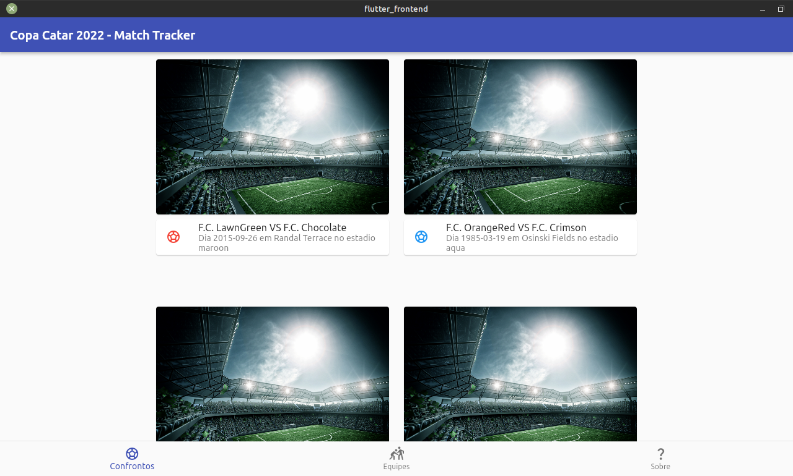
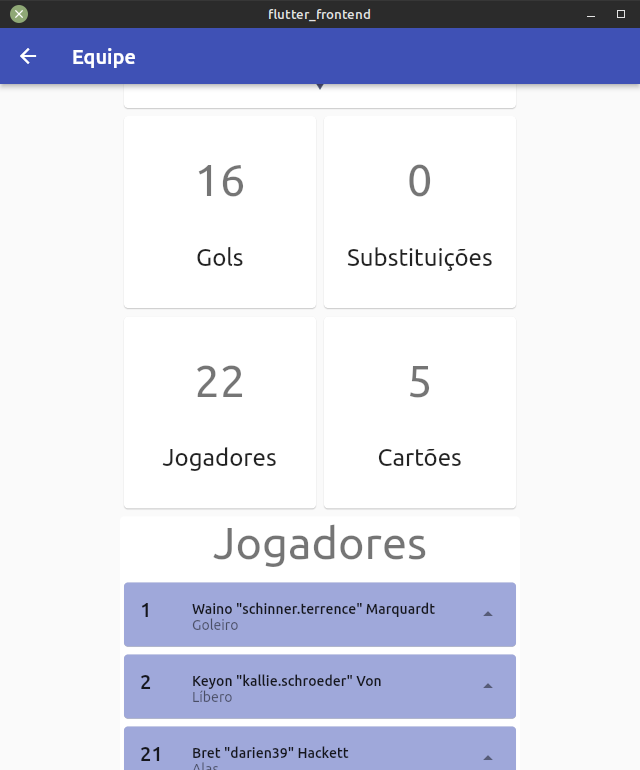

# Copa Catar 2022 Match Track

Aplicação fullstack estruturada a apresentar jogos da copa do mundo de futebol de 2022 em Catar.
O modelo entidade e relacionamento criado para representar os dados a serem guardados encontra-se nesse [link](imagens/entity_relationship.drawio.png).

## Como usar ?

Para testar a aplicação, os seguintes passos devem ser tomados:

**1. Inicializar o servidor Laravel e a base de dados integrada com o docker:**
```bash
docker compose up
```
**2. Aguarde até ver uma mensagem semelhante no terminal:**
```
[Note] /opt/bitnami/mariadb/sbin/mysqld: ready for connections.
```
**3. Gere as chaves do Laravel**
```bash
docker compose exec myapp php artisan key:generate
```
**4. Faça as migrações e o seed dos dados para teste na base de dados:**
```bash
docker compose exec myapp php artisan migrate --seed
```

**5. Configurar o endereço IP no arquivo `flutter_frontend/lib/misc/configs.dart`, modificando a variável `const hostIpAddress = '192.168.1.69'` com o IP da sua máquina no lugar. O IP tem de ser definido numa constante pois caso se queira testar a aplicação no celular, isso vai garantir acesso do celular ao servidor Laravel se o computador e o celular estiverem conectados na mesma rede Wifi.**

**6. Executar a aplicação Flutter, com os seguintes comandos:**
```bash
cd flutter_frontend
flutter run --no-sound-null-safety
```
**7. Testar a aplicação**

**8. Pronto**

### Notas

**Nota 1**: O seed da base de dados não precisa ser feito toda vez que se deseje testar a aplicação desde que os containers criados inicialmente estejam preservados. O primeiro seed (caso ocorrer com sucesso) será suficiente para testar a aplicação.

**Nota 2**: A aplicação em flutter tem todas as plataformas atualmente suportadas pela framework ativadas, então, pode ser testada em todas elas.

## Imagens






